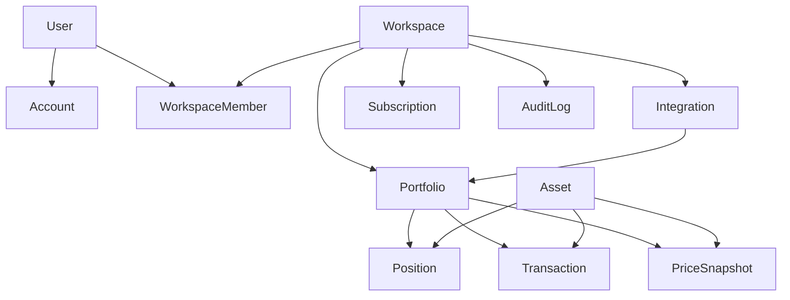

# SaaS Architecture

## Purpose
This document describes how the current private investment dashboard evolves into a multi-tenant SaaS platform without breaking the existing production flow.

## Current State Audit

### What already exists
- Next.js App Router application with private dashboard and protected private API routes.
- Token-gated access model for the legacy single-tenant deployment.
- Google Sheets and Google Drive workbook integrations for read and optional write-back.
- Portfolio assembly pipeline with normalization, valuation, transaction accounting, risk analytics and charts.
- Health/settings surface, rate limiting, hardened response headers and deployment documentation.

### What is strong enough to keep
- `src/lib/sheets` already behaves like an integration boundary and should remain an adapter layer.
- `src/lib/portfolio` already separates domain calculations from UI rendering.
- `src/lib/providers` already models valuation providers and can be extended for SaaS workloads.
- The current private route can remain as a legacy access mode for owner-only deployments.

### SaaS blockers in the current design
- Single-tenant assumptions: one hidden route, one shared token, one implicit owner.
- No database-backed identity, workspace, billing or authorization model.
- Google Sheets currently acts as both integration and primary persistence layer.
- Private API routes do not yet carry user, workspace or portfolio scoping.
- No subscription model, invitation flow or organization-level permission boundary.

## Target Product Model
The SaaS version should support:
- multiple users;
- multiple workspaces per user;
- multiple portfolios per workspace;
- multiple integrations per portfolio;
- subscription plans and feature limits;
- owner/admin/member/viewer roles;
- legacy private dashboard mode for users who still prefer hidden-link access.

## Core Architectural Principles
- Keep the current production dashboard running during the migration.
- Introduce database-backed SaaS capabilities in parallel, not as a hard rewrite.
- Treat every external source, including Google Sheets, as an integration adapter.
- Move source-of-truth responsibility for SaaS entities into PostgreSQL.
- Keep portfolio calculations provider-agnostic and reusable across legacy and SaaS modes.
- Scope every mutable operation by user, workspace and portfolio.

## Bounded Contexts
- Identity and Access: users, accounts, sessions, authentication, roles.
- Workspace Management: workspaces, memberships, invitations, permissions.
- Portfolio Domain: portfolios, assets, positions, transactions, price snapshots.
- Integrations: Google Sheets, CSV imports, JSON uploads, future Steam and API connectors.
- Valuation Engine: crypto, CS2, Telegram gifts and future provider chains.
- Billing: subscriptions, plan limits, trial state, billing provider sync.
- Audit and Compliance: audit logs, admin actions, import history, sync history.

## Target Domain Model

### User
Represents a human who can authenticate into the SaaS app.
- Owns or joins one or more workspaces.
- Can have multiple auth accounts and sessions.

### Account
Represents an auth-provider binding.
- Email/password, magic link, Google, Discord, Telegram or other providers later.
- Belongs to a single user.

### Workspace
Top-level tenant boundary.
- Has members, portfolios, integrations, subscription state and audit history.
- All authorization is evaluated inside a workspace scope.

### WorkspaceMember
Maps users to workspaces with a role.
- Roles: `owner`, `admin`, `member`, `viewer`.
- Controls write access, integration management and sharing actions.

### Portfolio
A logical container for tracked assets.
- Belongs to one workspace.
- Has visibility settings, base currency, risk profile and integration bindings.

### Asset
Canonical asset identity inside the SaaS domain.
- Categories: `cs2`, `telegram`, `crypto`, `custom`, future `nft` and others.
- Stores normalized identifiers and metadata needed for provider matching.

### Position
Current holding state for an asset inside a portfolio.
- Derived from transactions or synced from integrations.
- Stores quantity, current valuation state, entry basis, notes and risk metadata.

### Transaction
Append-only portfolio event.
- Buy, sell, transfer, fee, manual price update and future adjustment types.
- Primary source for PnL, ROI and auditability.

### PriceSnapshot
Historical valuation point for an asset or position.
- Used for history charts, analytics, alerts and cache warm-up.

### Integration
Configuration and sync state for external data sources.
- Examples: Google Sheets, Drive workbook, CSV import, Steam import.
- Stores encrypted config, status, sync mode and last sync metadata.

### Subscription
Workspace billing state.
- Plan tiers such as `free`, `pro`, `whale`, `team`.
- Tracks feature limits, billing provider ids and lifecycle status.

### AuditLog
Append-only security and business history.
- Admin actions, import events, integration syncs, permission changes and billing events.

## Relationship Map

## Integration Model
Google Sheets must stop being the implicit storage model and become one integration type among many.

### Integration types
- `google_sheets`
- `google_drive_workbook`
- `csv_upload`
- `json_upload`
- `steam_import`
- future external APIs

### Integration responsibilities
- Fetch raw source records.
- Map external structure into canonical SaaS entities.
- Expose sync metadata, validation warnings and write capability.
- Never bypass workspace and portfolio ownership rules.

### Google Sheets as an adapter
The current `src/lib/sheets` code should evolve into:
- source readers;
- source writers;
- validation helpers;
- normalization adapters;
- sync services that publish canonical data into database-backed portfolios.

## Source of Truth Strategy
- Legacy mode: Google Sheets or Drive workbook remains the source of truth for one private portfolio.
- SaaS mode: PostgreSQL becomes the source of truth for users, workspaces, portfolios, positions, transactions and subscriptions.
- Integrations become import/sync channels, not tenant identity or authorization boundaries.

## Request Flow in the Target SaaS
1. Auth middleware resolves the user session.
2. Workspace middleware resolves the active workspace and role.
3. Portfolio routes resolve the requested portfolio within that workspace.
4. Reads use database-backed portfolio snapshots and cached provider enrichments.
5. Integration sync jobs import or reconcile external data.
6. Audit log entries are written for privileged mutations and sync events.

## Permission Model
- `owner`: workspace ownership, billing, integrations, destructive actions.
- `admin`: manage portfolios, integrations and members except ownership transfer.
- `member`: manage portfolio content within granted portfolios.
- `viewer`: read-only access and shared dashboard viewing.

## Legacy Private Mode
The existing hidden route and token gate remain valid as a compatibility surface.
- It is not the main SaaS access model.
- It can be attached to one workspace/portfolio later as a legacy sharing mode.
- It should continue to use the current private API security model until SaaS auth fully covers the use case.

## Recommended Rollout Order
1. Freeze architecture and migration docs.
2. Add PostgreSQL and SaaS schema.
3. Add auth and workspace membership.
4. Add SaaS routes under `/app`.
5. Attach integrations to database-backed portfolios.
6. Keep legacy route active until the SaaS portfolio UI reaches parity.

## Risks to Watch
- Mixing legacy single-tenant assumptions into SaaS routes.
- Treating Google Sheets as a permanent source of truth for all SaaS tenants.
- Coupling pricing providers directly to UI instead of a valuation service boundary.
- Introducing workspace auth before database ownership models are ready.
- Attempting automatic production migration without an explicit user-triggered flow.
